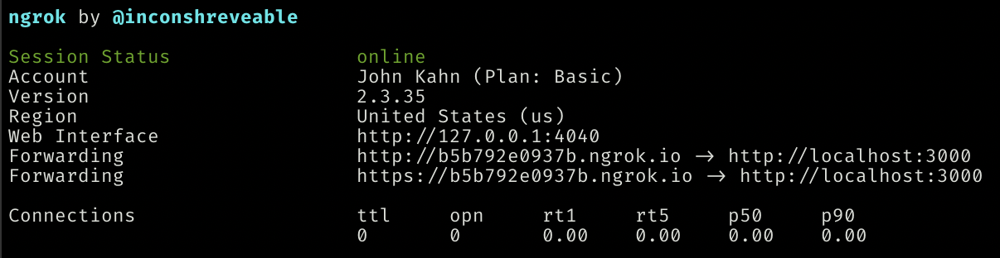

[](https://opensource.org/licenses/MIT)

<!-- [](https://codecov.io/gh/AmericanAirlines/Ticket-Counter) -->
<!-- [](https://lgtm.com/projects/g/AmericanAirlines/Ticket-Counter/alerts/) -->
<!-- [](https://lgtm.com/projects/g/AmericanAirlines/Ticket-Counter/context:javascript) -->
# Ticket Counter 🎟
Getting tech support should be easy
### Let's get started...
  1. [Using Ticket Counter](#using-ticket-counter)
  1. [Local Development](#local-development)
  1. [CI/CD](#cicd)
   1. [Contributing](#contributing)

 ## Using Ticket Counter
 # `DOCS NEEDED`

 ---
 ## Local Development
 Before getting started, make sure to install [Node (LTS)](https://nodejs.org/en/download/) (v14.0+) and run `npm i` to install all necessary dependencies.

---
### Environment Variables
Project environment variables should first be defined in `.env.sample` without real values for their data (that file is tracked by git). After cloning, make sure to duplicate `.env.sample` as `.env` and then fill in all required variables using the details provided in the section below.
---
### Postgres
Ticket Counter uses Postgres 11, so you'll need to set it up on your machine. If you don't have Postgres installed already, see the [Installation and Use](#installation-and-use) section below.
Create a database (we suggest `ticket-counter`, if you chose something else or are running your server on a different port, make sure to create a `DATABASE_URL` value in `.env` with your override URL) in the PostgreSQL 11 server (do not make a new server), and then run the app. If your Postgres server is protected by a password, you'll need to add `PGUSER` and `PGPASSWORD` to your `.env` file where `PGUSER` will be `postgres` and `PGPASSWORD` will be the Postgres server password entered during installation.
When the app is deployed to a cloud environment, the `DATABASE_URL` `.env` var will be used (and is automatically set in Heroku when an associated service is connected to your app).
 <details>
   <summary><strong>Postgres Installation and Use</strong></summary>

   #### macOS
   We recommend using [Postgres.app](https://postgresapp.com/) as the installation doesn't require a password and is generally easier to use that the traditional Postgres app below.

   #### Windows/macOS/Linux
   During the installation process (if you follow the steps on [postgresql.org](https://www.postgresql.org/download/)), you will be prompted to set a password - make sure to use something you'll remember.

   #### Viewing/Editing the DB
   If you'd like a visual way of viewing or editing your local database, try using [TablePlus](https://tableplus.com).
 </details>

---
### [ngrok]
[ngrok]: https://ngrok.com
[ngrok URL]: #ngrok
Both GitHub and Slack require that they can call your app for webhooks. To do this in local development a tool like [ngrok] is required to tunnel requests to your local instance.
> ❗ If you are using the free version of [ngrok] then each time you run it you will be given a different URL. This means you will need to update both GitHub and Slack with your new URL every time.
#### Run this to start your ngrok tunnel
```bash
ngrok http 3000 # Use whatever port your app is listening on
```
You will get this output after running. You'll want to use the `Forwarding https` URL on the left side of the arrow.
> Going forward when this documentation says "ngrok URL" it is referring to that URL.

---
### Create a GitHub App
Before being able to run the app locally, you'll need to create a Slack app and configure it with the appropriate permissions:
- Go to github.com
- Go to your Settings
- Go to Developer Settings
- Go to GitHub Apps (should be the default page)
- Click `New GitHub App`
  - Sign in if needed
- Leave everything default except for the following
  - Enter a name for App Name (this must be unique across all of GitHub)
  - Set `http://localhost:3000` for Homepage URL
    - This can be any URL, it's just for the App Page
  - Put your [ngrok URL] in the `Webhook URL` field, followed by `/github/webhook`
  - Create a secret and put it in `Webhook Secret`
    - You'll also want to put this in your `.env` file for `GITHUB_APP_WEBHOOK_SECRET`
  - Change these settings on `Permissions`
    - Set Contents to `Read-only`
    - Set Issues to `Read & write`
  - Check the box next to `Issues` under the `Subscribe to events` section
  - Check the box next to `Issue comment` under the `Subscribe to events` section
- Click Create GitHub App
- Copy the App ID into your `.env` file
- Generate a private key and move the downloaded file to the root of the project
- Set `GITHUB_APP_PEM_FILE` to the name of the file
- Click `Install App` on the left side and install it to a repo (create a demo one if you don't have one)
- After installing copy the number in the URL bar to `GITHUB_APP_INSTALLATION_ID` in your `.env` file
---
### Create a Slack App
Before being able to run the app locally, you'll need to create a Slack app and configure it with the appropriate permissions:
- Create an app on the [Slack API Site](https://api.slack.com/apps)
- Using the sidebar, navigate to "_OAuth & Permissions_" and enable them
  - Under '_Scopes_' --> '_Bot Token Scopes_' click `Add an OAuth Scope` and add the following scopes:
    - `channels:history`
    - `channels:manage`
    - `chat:write`
    - `chat:write.public`
    - `commands`
    - `reactions:write`
    - `users:read`
    - `reactions:read`
- Using the sidebar, navigate to "_Event Subscriptions_" enable them
  - For the `Request URL` field, use your [ngrok URL] and then append `/slack/events`
  - Under "_Subscribe to bot Events_", add the following scopes:
    - `message.channels`
    - `app_home_opened`
  - Click  "_Save Changes_" at the bottom of the page
- Using the sidebar, navigate to "_App Home_"
  - Scroll to "_Your App's Presence in Slack_" and click "_Edit_" next to "_App Display Name_" (e.g., using `Ticket Counter` for the name and `Ticket-Counter` for the username is recommended)
  - We also recommend enabling "Always Show My Bot as Online"
  - Enable the home tab in the _Show Tabs_ section
  - Finally, in the _Show Tabs_ section, disable the _Messages Tab_
- Using the sidebar, navigate to "_Basic Information_"
  - scroll to, to "_App Credentials_" and copy the `Signing Secret` value and use it to replace the `SLACK_SIGNING_SECRET` value in your `.env`
- Using the sidebar, navigate to "_Install App_" and click "Reinstall App"
  - Once finished, copy the `Bot User OAuth Access Token` value and use it to replace the `SLACK_TOKEN` value in your `.env`

Once the above steps are finished, you'll need to connect your Slack app to your app running locally. Follow the steps in the [Starting the App](#starting-the-app) section below. After the app is running, you can use [ngrok](#ngrok) to create a publicly accessible URL. Copy that URL and head back to your app's settings:
- Using the sidebar, navigate to "_Interactivity & Shortcuts_" and enable them
  - For the `Request URL` field, use your [ngrok URL] and then append `/slack/events`
  - Under Shortcuts, chose "_Create New Shortcut_", chose "_Global_", and use the following values:
    - Name: `New support ticket`
    - Short Description: `Opens a support ticket and posts details in Slack`
    - Callback ID: `submitTicket`
    - Click "_Create_" at the bottom of the popup
  - Click "_Save Changes_" at the bottom of the page
- After clicking save, using the sidebar, navigate to "_Install App_" you should see a banner at the top of the page suggesting you reinstall the app; click `Reinstall your app` or `Reinstall to Workspace`

 ---

### Advanced
#### Database Changes
If database schema is changed, the migrations must be changed accordingly. After starting the app (or using `npm run typeorm migration:run`), make changes to files in the `src/entities` directory as needed and then run `npm run typeorm migration:generate -- -n MigrationName` where `MigrationName` is the name of the migration (without the timestamp).
#### Migrations
Do not update or remove an existing migration, as this can cause unexpected issues with local and production data. All database schema changes must be made in a new migration.
---
### Starting the App
The best way to start the app and work on it is by using `npm run dev`, which will start the app and then restart the app whenever a TypeScript file changes. After modifying a non-Typescript file, restart the app by typing `rs` into the same terminal you ran `npm run dev` from and then hitting return.
 After the app starts, it will be accessible on `localhost:3000` (unless the port was modified via `.env`).

 ---

 ## CI/CD
 This repo utilizes two GitHub Workflows:
 - `Build and Deploy`: Builds the app for all PRs and deploys when a `push` event (merge) occurs on the `main` branch (Default deployment environment is IBM Cloud Foundry, but the workflow can be modified to deploy to other environments)
- `Test`: Runs the full `jest` test suite and evaluates coverage
 ---
 # Contributing
 Interested in contributing to the project? Check out our [Contributing Guidelines](./.github/CONTRIBUTING.md).
